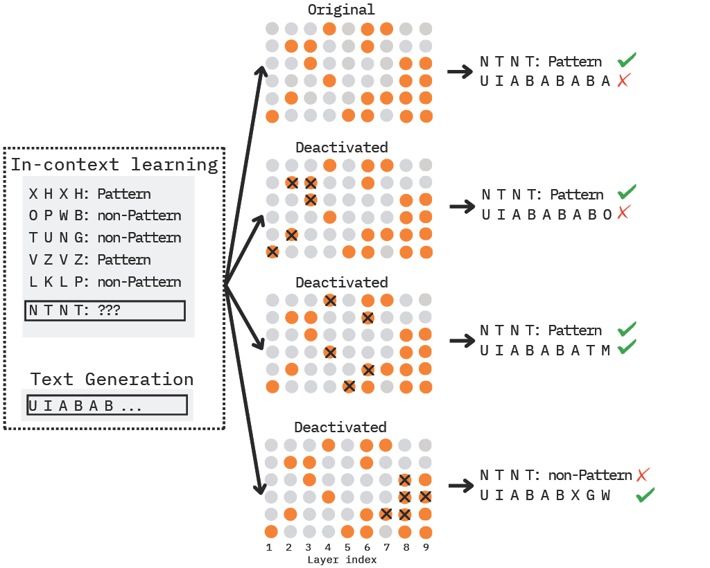

# Understanding and Controlling Repetition Neurons and Induction Heads in In-Context Learning 

## Introduction

This paper investigates the relationship between large language models’ (LLMs) ability to recognize repetitive input patterns and their performance on in-context learning (ICL). In contrast to prior work that has primarily focused on attention heads, we examine this relationship from the perspective of skill neurons, specifically repetition neurons. Our experiments reveal that the impact of these neurons on ICL performance varies depending on the depth of the layer in which they reside. By comparing the effects of repetition neurons and induction heads, we further identify strategies for reducing repetitive outputs while maintaining strong ICL capabilities.

Venue: IJCNLP-AACL 2025 (Oral)



The data generator lives in `script/repnr_data.py`. After installing the project dependencies (`pip install -r requirements.txt` or `pip install -e .` from the repo root), run:

1. Authenticate with Hugging Face so the script can download models:

   ```bash
   export HF_TOKEN=your_hf_api_token
   ```

2. Execute the generator from the repository root:

   ```bash
   python script/repnr_data.py \
       --model-name meta-llama/Llama-3.1-8B \
       --num-samples 1000 \
       --output-dir data/repetition_neuron_data
   ```

This creates (or appends to) `data/repetition_neuron_data/<model>.jsonl`, writing one JSON record per detected repetition sample. Run `python script/repnr_data.py -h` for the full list of configurable arguments (seed, n-gram length, token counts, etc.). For `num-samples`, normally needs 1-3000 samples to get 1000 repetitive instances as in paper, depend on model's size.

## Text-Generation Ablation Study

`script/textgen_rep_ab.py` reproduces the notebook ablations for repetition neurons and induction heads. It loads an existing repetition dataset (from the generator above), ranks neurons using the first `--base-samples`, runs ablations on the next `--eval-samples`, and writes JSONL summaries for every experiment to `--output`.

Example invocation (tiny numbers for a quick test):

```bash
python script/textgen_rep_ab.py \
  --model-name meta-llama/Llama-3.1-8B \
  --data-path data/repetition_neuron_data/Llama-3.1-8B.jsonl \
  --neurons-to-ablate 50 100 \
  --percent-heads 1 3 \
  --base-samples 3 \
  --eval-samples 3 \
  --seed 42 \
  --output data/textgen_ablation_results.jsonl
```

For the full experiment, raise `--base-samples`/`--eval-samples` (the paper used ≈1000/100). Customize `--neurons-to-ablate` and `--percent-heads` to choose exactly which K neurons or percent of induction heads to ablate, or skip either branch with `--no-neuron-ablation` / `--no-head-ablation`.

## ICL Repetition-Neuron Ablation

`script/icl_repnr_ab.py` is the sample of “layer-wise” repetition neurons experiment. First, rank neurons to identify repetition neurons, then runs `repetition_neurons.run_segment_ablation_study_2phase` on each abstract ICL dataset (rep/rec/ceb/wsq1/wsq2), and report the Foo/Bar recall per layer segment while also writing the raw results to `data/ablation_neuron_only.jsonl`.

Example (limits each task to the first 10 prompts for a quick check; edit `SAMPLE_LIMIT` inside the script to use the full datasets):

```bash
python script/icl_repnr_ab.py
```

The script reports `task -> modes: ['top','random']` and the per-segment recall (plus baseline). You can feed the saved JSONL into `utils.compute_ablation_accuracies` to reproduce the tables/plots from the paper.***

## ICL Induction-Head Ablation

`script/icl_ind_ab.py` runs induction-head ablations only. It computes prefix-matching scores, ablates heads via `induction_heads.ablate_attention_heads_8`, and reports per-task accuracy. The script saves JSONL output to `data/ablation_head_only.jsonl`.

Example (limits each task to the first 10 prompts for a quick check; edit `SAMPLE_LIMIT` inside the script to use the full datasets):

```bash
python script/icl_ind_ab.py
```

## ICL Joint (2-Phase) Ablation

`script/icl_joint_ab.py` runs joint ablations of repetition neurons and induction heads using `utils.run_dual_ablation_study`. It samples a small subset of each ICL task for quick runs and prints class-wise accuracies per segment. Results are written to `data/ablation_joint_2phase.jsonl`.

Example:

```bash
python script/icl_joint_ab.py
```

Notes:
- `SAMPLE_LIMIT` is a fast-test cap; remove or raise it for full runs.
- `utils.run_dual_ablation_study(..., progress="outer")` reduces tqdm spam. Use `"full"` for all nested progress bars.
